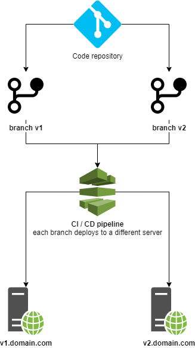

# ShortUrl documentation

## Source code

### Auth

- `AuthToken` interface
  - `ParenthesisAuthToken` implementation
    - checks a parenthesis token is valid

### Http

#### Controllers

- `Api\ApiController`
  - serves as base for all api controllers
- `Api\ShortUrlController`
  - controller for `/api/v1/short-urls` endpoint

#### Middleware

- `AuthenticateToken`
  - checks bearer token in current request is valid
- `JsonHeaderMiddleware`
  - force laravel to issue json response

#### Requests

- `ShortenUrlRequest`
  - validates the request for `ShortUrlController@shortenUrl`

### Repositories

- `ShortUrlRepository` interface
    - `TinyUrlRepository` implementation

### Traits

- `AnswersJsonRequests`
  - common method shared to issue a json response
    - used by
      - `App\Http\Controllers\Api\ApiController`
      - `App\Http\Middleware\AuthenticateToken`

## Testing

Run the following command to execute tests and see code coverage

```php artisan test --coverage```

### Feature tests

- `AuthTest`
  - Tests authentication of the app
- `ShortUrlTest`
  - Tests `/api/v1/short-urls` endpoint

### Unit tests

- `Auth\Token`
  - Tests of `Auth\Token` implementations
- `Repositories\ShortUrl`
    - Tests of `Repositories\ShortUrl` implementations

### Postman

[Download resources/postman/ShortUrl.postman_collection.json](resources/postman/ShortUrl.postman_collection.json)

## Deployment


